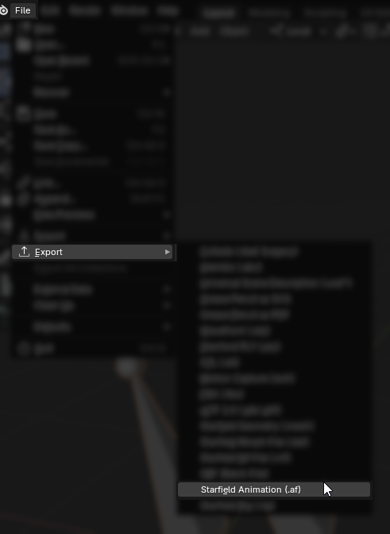
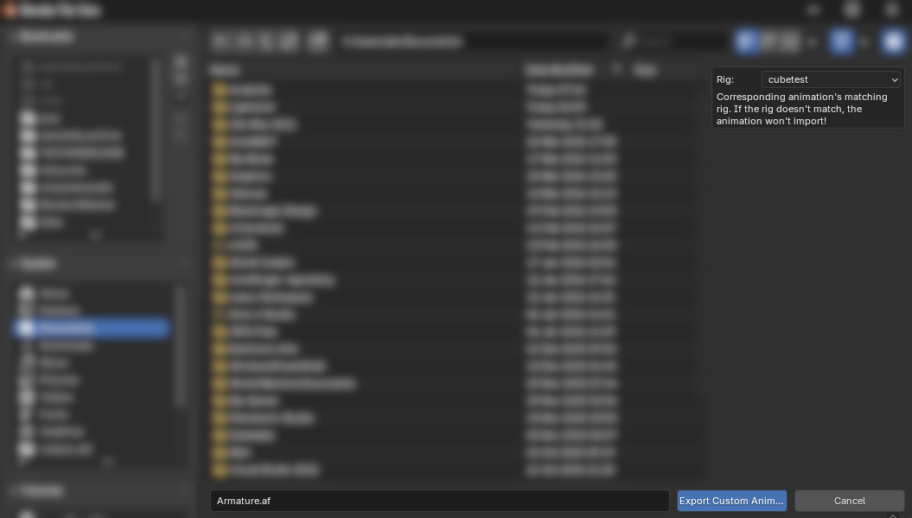

This part of the tutorial has general animation info.

[Back to Main Tutorial](sf_animation_io_docs.md)

[Blender-specific Animation Docs](docs_blender_animation.md)

___

# Exporting custom animation

When you think your animation is ready, you may want to export it. Before exporting an animation, make sure the armature is marked as `Is Animation` - which can be done via checkmark at the Starfield Animation Management panel added by the addon. The checkmark only allows it to be exported as .af file by the addon. Additionally, make sure the rig you're exporting an animation for, is registered (see [Do I need to register the rig?](docs_rig.md#do-i-need-to-register-the-rig))

The animation export screen looks as following:

Within the `Rig` dropdown, select your registered rig, give your animation a name (you always can rename the `.af` later), and hit Export.

