This part of the tutorial has general animation info. If you already know the Blender-specific animation details, you may skip the section.

[Back to Main Tutorial](docs_main.md)

[AnimationIO-specific Animation Docs](docs_animation.md)
___

# Blender Bones explained

Bones represent individual moving part, such as a Propeller of a Fan, or a Leg of the creature.
The bone has a Head and a Tail, which can be determined by the bone width:

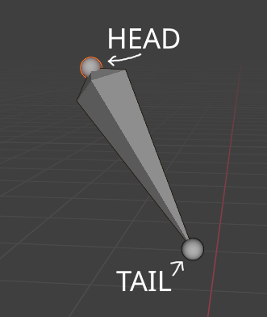

It can be easily determined by the bone width if the Armature bone display is set to Octahedral, as on image:

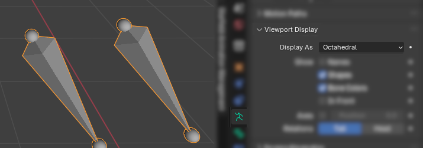

Different display modes will display the bones in a different way, such as Stick:

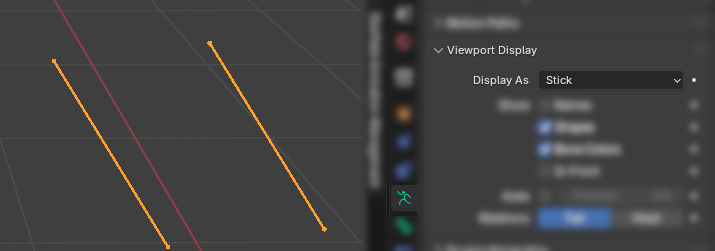

In creating Starfield rig, the Bone's Pivot = Bone's Head, and bone length (the length of the connection from Head to Tail) shouldn't matter (still, not recommended to change anything about it on existing rigs/rigs that already have animations baked), as the Starfield Animation IO plugin will recalculate it automatically on export, so the bone length may change on export - most likely, the length of all bones will become exactly `0.07 m`.

However, bone roll matters more. Bone roll is the 'invisible'/'barely visible' rotation of the bone that affects how it may be manipulated in the pose mode.

Such as, consider the following example, with a first bone having roll of 0, and a second bone having a roll of 90. 

They appear identical:

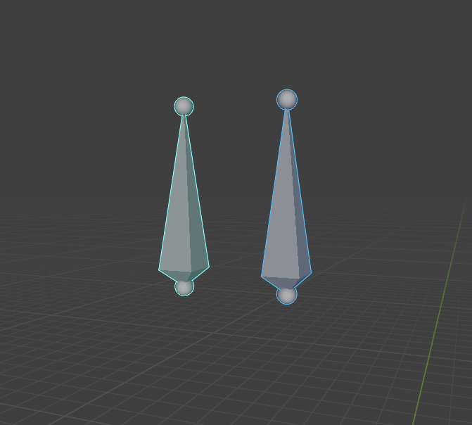

However, if you attempt to rotate the bones on some **local** axis (for example, X), they will rotate in a different way, which is happening because the bones have different roll:

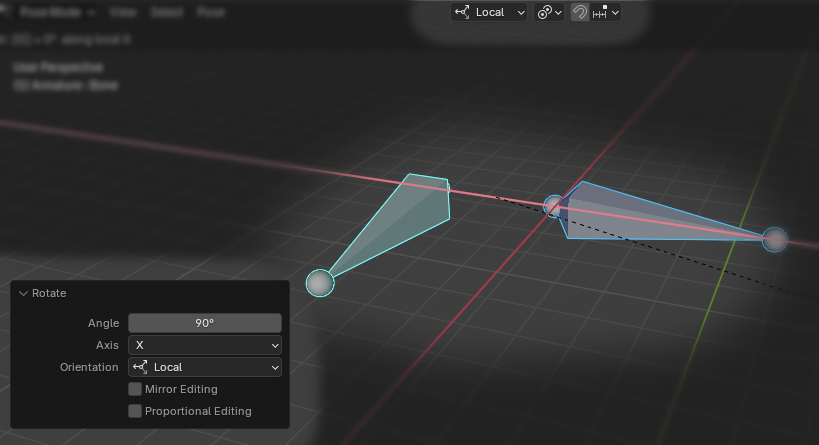

# Pose mode vs Edit mode on an armature

**Edit mode** (bones show up yellow/orange) allows you to edit the initial ('rest') bone positions of an armature. If you're making a new animation without any intention to export a new rig, you may not edit the bones of the armature in the Edit Mode, as it will cause problems.

In the **Pose Mode**, where bones show up cyan or blue, you can edit the armature's bone positions, rotations, and scale for a specific timeline frame (e.g. frame 0, frame 6, etc.). The Pose Mode is suitable for creating new animations. If you wish to edit the rig with plans to export the rig, please don't use Pose Mode.

> **Scale can only be uniform**, so 1.0 for everything; `.af` file does not support individual axis (x,y,z) scaling.

# Blender: Creating a simple animation

This section of the tutorial is intended for people who wish to learn how to animate simple things in Blender.

## Opening the Timeline

Before starting creation of an animation, make sure you have the timeline panel open.
To create a new panel, drag any corner of the window:

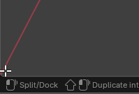

Keep on dragging:

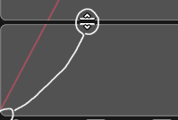

And release. You will most likely see a duplicated viewport below. Click on the top-left icon of the duplicated viewport that appeared:

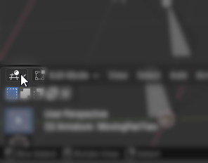

Pick **Timeline**:

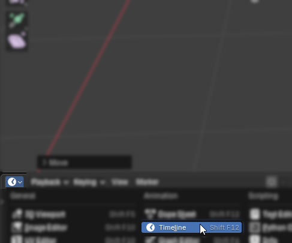

> Other editors - Dope Sheet, Graph Editor, Drivers, Nonlinear Animation are representing the same data, but in a different way - some of other editors are either more advanced, too simplified, or are representing different data. This section of the tutorial will focus within `Timeline` editor, but you may experiment with different editors.

### Animating in Blender

Animation is done in the `Pose Mode` of the armature. **Don't animate the objects individually in the Object Mode, as Object Mode animation will not be exported at all.**
Have an armature active and enter **Pose Mode**. You will see something similar to this:

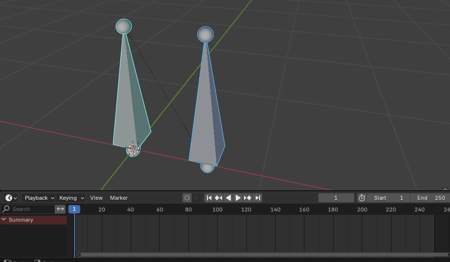

**The dashed line** between bones represents the Bone Hierarchy, meaning one of them is parented to another.
**The timeline** will show the keyframes that will be explained next.
**Start/End** with numbers show the in-Blender starting and ending points of the animation.
**Cyan** is the Active bone. There can only be only one active bone at a time, or none at all.
**Blue** is the Selected bone. There can be multiple selected bones, or none at all.

You can manipulate the blue cursor on the timeline by dragging it on the the dark grey numbers line.

#### Creating Keyframes

Creating keyframes can be done as simply as having your bones positioned as you want them to be, making sure the blue cursor is right at the timeline position you want the keyframe to be created at, and pressing `I`

> Tip: Generally when animating, it is recommended to create keyframes for all bones at the starting point of the animation (e.g. zero)

Additionally, you may utilize the `Auto-Keying` button which creates keyframes at your timeline cursor position once you adjust the bones - but if it becomes overwhelming, you can always turn it off.

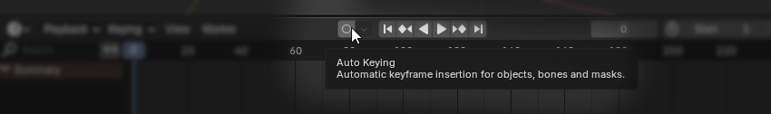

The moment you press `I` - the yellow dots should appear:

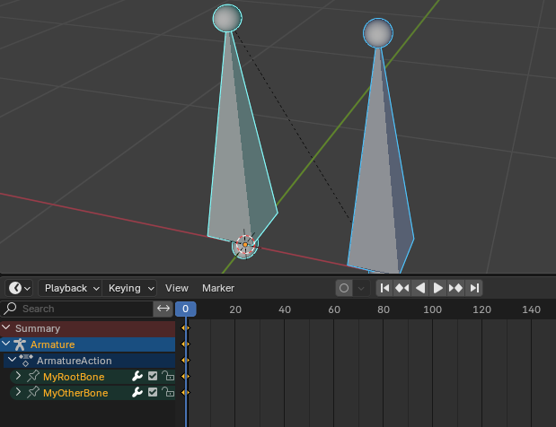

In the next image, the bones were moved and `I` was pressed again:

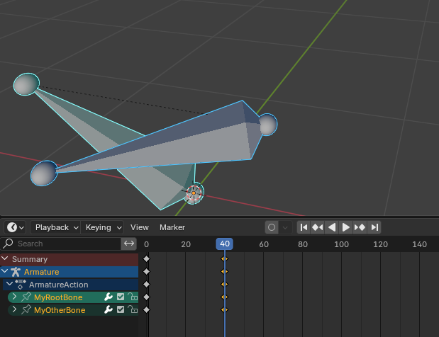

In result, when the timeline cursor is moved elsewhere, the animation is adjusted, as on the following image:

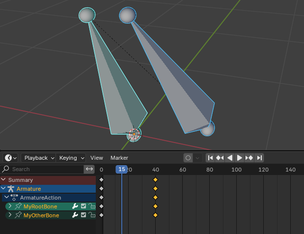

> Essentially, the blue cursor can be seen as "scrolling the animation to see what the individual frames look like at certain positions"

You also can use the Play button to play your animation, additionally you may want to set the `Start`/`End` of the animation.

___

Next, you may want to export your animation. In that case, check [Animation Docs](docs_animation.md)
