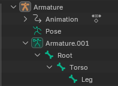
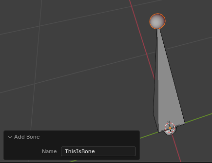
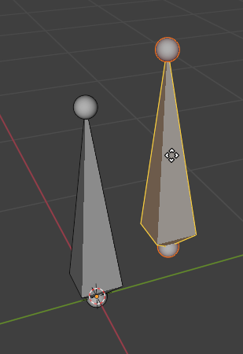
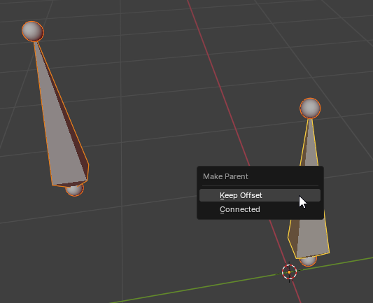
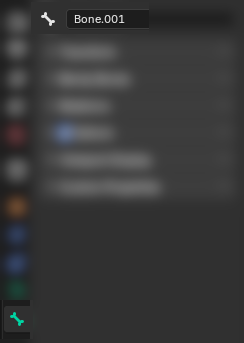
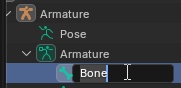
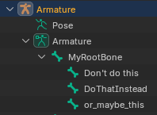
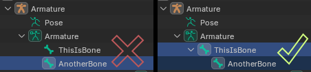

This part of the tutorial will cover everything about Armatures/Rigs in Blender-specific context.

[Back to Main Tutorial](sf_animation_io_docs.md)

[AnimationIO-specific Rig Docs](docs_rig.md)

___

## Blender: Creating a custom rig

If you already know how to manipulate the armature in Blender, you may skip this step as it will explain the basics of editing an armature in Blender.

### Bone hierarchy explained

Bone Hierarchy is the way bones are parented. Such as, consider the following imaginary example: Leg is parented to Torso, and Torso is parented to Root, resulting in the following hierarchy:

The hierarchy is very important. At least, moving the parent bone will result in moving all the child bones. To know for sure what kind of hierarchy will suit your custom rig best, it's advised to experiment with the imported vanilla rigs in pose mode, which can be a very good way of learning how it works.

### Adding a bone

In Edit Mode, press `Shift + A`  - which will create a brand-new bone:

 A different way to create a bone is to duplicate existing bone(s) by selecting it and hitting `Shift + D` - make sure to give the bone duplicated that way, a proper name ([Renaming a Bone](#renaming-a-bone)).
 

### Parenting the bone

An important part of the rig is the bone hierarchy. As it was said before, the rig should have single root bone (single first bone in the hierarchy), not more. To parent bone(s) to another bone, select the bones you want to be lower in the hierarchy tree and make sure your parent bone is active, and press `Ctrl + P` and select `Keep offset`

### Renaming a bone

Renaming a bone can be done in many ways, such as having a bone active in Edit Mode and navigating as on image:

Or, by double-clicking the bone in the Outliner's armature hierarchy:

## General Important Details about Armature/Rig

Having spaces/special symbols (such as, dots) in the bone name is **untested, and therefore is not recommended.**

**Make sure there's only one root bone in hierarchy, so a single first bone**
First side with a red cross shows two root bones, which is incorrect.
Second side shows a single root bone (called 'ThisIsBone' in this example), which is correct.

