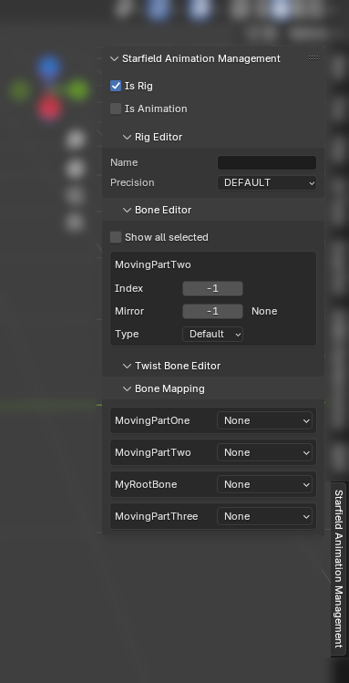
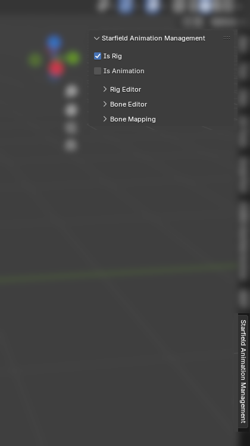
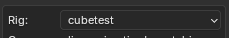

This part of the tutorial will cover everything about Rigs.

[Back to Main Tutorial](sf_animation_io_docs.md)

[Blender-specific Rig Docs](docs_blender_rig.md)

___

# Creating a custom rig

This section of the tutorial will explain the process of creating a custom rig.

## FAQ

### Is a custom rig needed for my use-case?

Custom rig is needed when the animated object has/is planned to have something that cannot be accomplished with vanilla rigs, such as having more bones/bones in different starting positions.

### What is a rig?

In this context, rig means skeleton, but special - used in game's animation system. It may differs from skeleton contained in the `skeleton.nif` - or, may be identical; which depends on the object.

## Rig panel

To set up Starfield rig specific settings for your rig, go to the side (N hotkey) panel, which can be found by looking for Starfield Animation Management title. Mark it as `Is Rig` by clicking on a checkbox, and optionally mark it as `Is Animation`. Marking it doesn't change anything except allowing it to be exported by the Animation IO addon, and making some specific UI elements available for the specific object. Before exporting the rig, there are a few Starfield-specific important details that must be set. If your armature is marked as rig on the Starfield Animation Management panel, a few extra options will appear in Edit Mode once you will have at least one bone active and optionally more bones selected:

**Name**: Set the name of the rig. Currently, unused.

**Precision**: A value found to differ on various rigs; select which seems to be appropriate for your rig from the drop down.

### Bone Editor

Bone Editor is a section for managing Starfield-rig-specific bone settings.

**Index**: Matters a lot, should start from 0 (root bone should be zero) and increment (Root = 0, next bone = 1, etc.) - it should stay unique per-bone.

**Mirror**: Index of the bone's symmetrical equivalent (such as, L_Arm may reference R_Arm). Can stay -1 without problems.

**Type**: Default or Twist. Twist bones cannot be animated, and all keyframes of twist bones will be dropped on export as testing has shown keyframes of the bones marked as Twist won't play in-game.

### Bone Mapping

At least, the Root bone should be mapped as Root. It is ok to leave Custom rig bones as None.

## Setting up a rig to work with the addon

# Exporting Custom Rig

Make sure your rig is set-up (see [Creating a Custom Rig](#creating-a-custom-rig) for details on creating a custom rig), go to File -> Export, and pick Rig. Export as usual.

# Registering Custom Rig

## FAQ

### What does the registering rig do?

Registering the rig moves it into Blender Animation IO addon folder, making it available in the rig drop-down when importing an animation.
**The dropdown** on importing an animation looks as following:

Which will contain your previously registered rigs. You cannot import any `.af` animation without having a single rig registered.

### Do I need to register the rig?

Registering the a is used in animation import. If you plan to import `.af` animations that are made for the rig, then you have to register the rig. It is done once - your previously registered rigs will be saved on disk (in the addon folder, precisely).

### When do I need to re-register the rig?

You need to register the rig again if you answer 'Yes' to any of the following questions:
- Have you changed the bone position/rotation?
- Have you changed the bone count in any way, either by deleting or adding new bones?
- Have you changed any of the rig properties, such as bone indices?
- Have you changed the bone hierarchy?
If answer to any of these questions is yes, then you have to re-register the rig by exporting it and then registering the file. You may give it the same name so it will overwrite your previous rig, or you may give it a new name if you prefer to iterate that way. Please keep in mind re-registering the rig **may make previous animations be imported incorrectly, possibly even  drawing the rig to be completely incompatible with the `.af` animations made for the previous iteration of the rig.**

## Registering Custom Rig

Make sure you have your rig on disk - be it existing rig or a custom rig (for details on exporting a custom custom rig, see [Exporting Custom Rig](#exporting-custom-rig)). 
