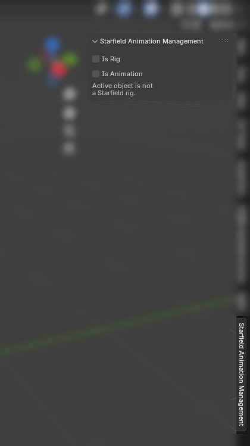

This document contains general information on using the fan-made Starfield animation addon, Animation IO.

___

# All Pages

[Animation Docs](docs_animation.md)

[Blender Animation Docs](docs_blender_animation.md)

[Rig Docs](docs_rig.md)

[Blender Rig Docs](docs_blender_rig.md)

[Old documentation](old_docs.md)

# Workflows

Pick what is the most close to your use-case:

### Workflow: Custom rig + Custom animation

If you want to create a custom animation with a custom rig:
1. Export custom rig ([Creating a Custom Rig](docs_rig.md#creating-a-custom-rig), [Exporting Custom Rig](docs_rig.md#exporting-custom-rig))
2. Register the newly exported rig ([Registering Custom Rig](docs_rig.md#registering-custom-rig))
3. Export custom animation ([Exporting Custom Animation](docs_animation.md#exporting-custom-animation))

### Workflow: Custom animation with existing rig

If you want to create a custom animation while already having a rig:
1. Register the rig ([Registering Custom Rig](docs_rig.md#registering-custom-rig))
2. Export animation (select newly registered rig in the dropdown) ([Exporting Custom Animation](docs_animation.md#exporting-custom-animation))

# Where to find the panel?

The panel should be called Starfield Animation Management, and have the general layout of:

___

The tutorial was written by Deveris and may be expanded in the future. To see the list of changes, check commits related to this document.
